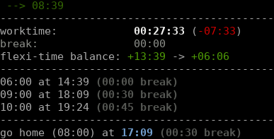
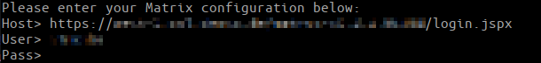

# GoHome

Util to show current worktime and possible leave times with Dorma integration.



## Getting started

To download and install the utility execute the following commands:

```
go get github.com/sbreitf1/gohome
go install github.com/sbreitf1/gohome
```

Now start it with `gohome` from command line.

You will probably be asked to enter a Dorma host. Paste the same host you visit in your browser (including protocol and path) here. Finally, you need to enter your Dorma credentials.



These values are stored in `~/.gohome/` and are used in all following runs. You can enter an empty password here to only store host and username. You will be prompted for your password on every run.

## Thanks

Thanks to `danielb42` for the [initial idea and cool project name](https://github.com/danielb42/gohome)!